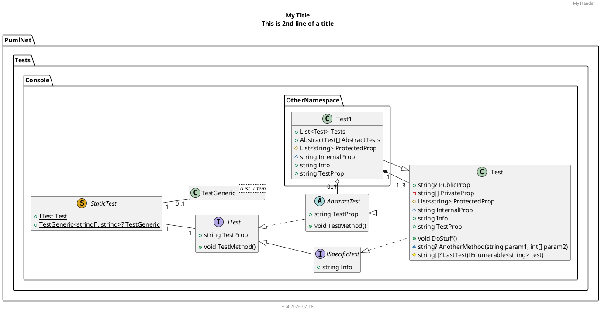

# Parse your .NET codebase to PlantUML

> Generate PlantUML *(markup language)* from .NET, which can be then drawn using tools of your choice.

## About

This project is a `NuGet` package that can be used to generate `PlantUML` markup from `.NET` code. It is compatible with **.NET 6.0+**.

### Features

Currently the project is in early stages of development. You can only generate class diagrams for now, although it is subject to change. It supports the following PlantUML features:

- Declaring elements
  - class
  - abstract class
  - interface
  - struct
  - static class
  - enum
  - generic types
  - namespaces
- Declaring relations *(specify relation using attributes)*
  - inheritance
  - composition
  - aggregation
- Labels on relations
  - one-to-one
    - based on nullability, `1` or `0..1` 
  - one-to-many
    - fine-tune using attributes *(e.g. `1..*`, `2..3`, etc.)*
  - many-to-many **(not yet implemented)**
- Element members
  - properties
  - methods
  - values (for enum)
- Declaring visibility
  > For props, getter visibility is used
  - public
  - private
  - protected
  - internal
- Styling
  - hide empty members
  - top to bottom, or left to right direction
  - member name + type layout (`TypeScript`-like, `.NET`-like, or even custom)
  - include overriden members in derived classes
  - indent style (tabs, spaces, none)
- Diagram elements
  - title
  - legend
  - header
  - footer
  - caption

### Future plans

- [ ] Add support for many-to-many relations (with association class)
- [ ] Add support for notes on type, member, or relation
- [ ] *If you have any ideas, feel free to open an issue*

# How does it work

This library scans the assembly in which you are generating the `PUML`. Then, using reflection, it is reading all metadata about your code and generating `PUML` markup. It is also converting type names to developer-readable, such as `System.Int32` to `string`, ``Dictionary`2`` to `Dictionary&lt;string, int&gt;`, and so on.

You can specify many options that control the look and style of your diagram, e.g.:

```csharp
var pumlOptions = new PumlOptions
{
    DiagramElements =
    {
        Title = "My Title\nThis is 2nd line of a title",
        Header = "My Header",
        Footer = new PumlString("~ at %date(\"yyyy-MM-dd\")", EscapeType.None),
    },
    StyleOptions =
    {
        IndentType = IndentType.TwoSpaces,
        Direction = Direction.LeftToRight,
        MemberDeclarationOptions =
        {
            Style = MemberDeclarationStyle.DotNet,
        },
    },
    IncludeOptions =
    {
        IncludeNamespace = true,
        IncludeInternal = true,
        IncludeOverridenMethods = false,
    }
};
```

Then, use these options to generate the diagram. Currently there are **2** main workflows supported by this library.


## 1. Generate PlantUML markup for a single class *(or struct, record, interface, enum, etc.)*

This approach will generate PlantUML markup for a single class. It will include all the classes that are referenced by the class you are generating markup for.

```csharp
var pumlOptions = new PumlOptions
{
    // ...
};

string diagram = Puml.GeneratePumlDiagram<Test>(pumlOptions);
```

## 2. Generate PlantUML markup for all classes in an assembly

This approach will generate PlantUML markup for all classes in an assembly. It will include all the classes that are referenced by the classes you are generating markup for.

```csharp
var pumlOptions = new PumlOptions
{
    // ...
};

string diagram = Puml.GeneratePumlDiagram(typeof(Test).Assembly, pumlOptions);
```

The above code will generate the following PUML:



The above `PUML` can be drawn using [PlantUML](https://plantuml.com/) or [PlantUML Server](https://plantuml.com/server), from where you can easily paste them into `README` files, like below.

